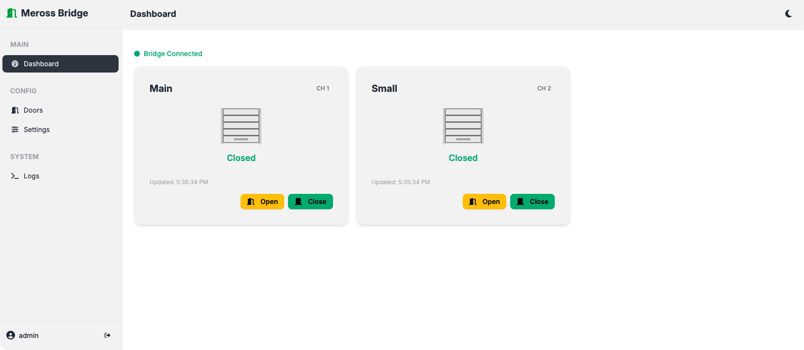

# meross-mqtt-bridge

A self-hosted Docker bridge between the Meross MSG200 garage door opener and a local MQTT broker. Includes a web GUI for configuration, monitoring, and control.



> **Homelab project** — This was built for personal use and published for the community.
> It works well but has not undergone a formal security audit. See [SECURITY.md](SECURITY.md)
> for known limitations before deploying. Contributions and issues are welcome.

## Features

- Bridges the Meross cloud API to your local MQTT broker
- Supports up to 3 doors (MSG200 channels 1–3)
- Web GUI for configuration, door control, and live logs
- Automatic config reload — no restarts needed when you change settings
- Exponential backoff reconnection for both Meross cloud and MQTT
- Retains door state on MQTT so subscribers always have the last known state
- Dark and light theme

## Requirements

- Docker and Docker Compose
- A Meross MSG200 garage door opener with a Meross account
- A local MQTT broker (e.g. Mosquitto)
- The MSG200 must be claimed and working in the Meross app before use

## Quick Start
```bash
# 1. Clone the repo
git clone https://github.com/mtnbiker717/meross-mqtt-bridge.git
cd meross-mqtt-bridge

# 2. Create required directories
mkdir -p config logs

# 3. Create your config from the example
cp config/config.example.yaml config/config.yaml

# 4. Build and start
docker compose up -d --build

# 5. Open the GUI
open http://localhost:8080
```

## First Run

1. Open `http://<host>:8080` in your browser
2. Log in with **admin / admin**
3. You will be prompted to change your password immediately — choose something strong (8+ characters)
4. Go to **Settings** and enter your Meross account credentials and MQTT broker details
5. Click **Test Connection** to verify both connections before saving
6. Go to **Doors**, enable the channels you want to use, set names and topics
7. The bridge picks up the config change automatically — watch **Logs** to confirm it connects

## MQTT Topics

### Commands (publish to these to control doors)

| Topic | Payload | Action |
|---|---|---|
| `garage/command/door_1` | `open` or `close` | Control door on channel 1 |
| `garage/command/door_2` | `open` or `close` | Control door on channel 2 |
| `garage/command/door_3` | `open` or `close` | Control door on channel 3 |
| Any command topic | `query` | Force a state refresh |

> Topic names are fully configurable per door in the GUI. The defaults shown
> above are examples — rename them to match your existing MQTT setup.

### State (subscribe to these for door status)

| Topic | Payload | Description |
|---|---|---|
| `garage/state/door_1` | `open` or `closed` | Channel 1 state, retained |
| `garage/state/door_2` | `open` or `closed` | Channel 2 state, retained |
| `garage/state/door_3` | `open` or `closed` | Channel 3 state, retained |
| `garage/state` | JSON | Combined state of all enabled doors + timestamp |

Example combined state payload:
```json
{
  "main": "closed",
  "small": "closed",
  "timestamp": "2026-03-16T17:30:00.000000"
}
```

All state topics are configurable per door in the GUI.

## Configuration Reference

Configuration lives in `config/config.yaml` and is managed via the GUI. Manual edits are supported — the bridge detects file changes and reloads automatically.

| Section | Field | Default | Description |
|---|---|---|---|
| `meross` | `email` | — | Meross account email |
| `meross` | `password` | — | Meross account password |
| `meross` | `api_url` | `https://iot.meross.com` | Meross API endpoint |
| `mqtt` | `host` | — | MQTT broker hostname or IP |
| `mqtt` | `port` | `1883` | MQTT broker port |
| `mqtt` | `user` | — | MQTT username (optional) |
| `mqtt` | `pass` | — | MQTT password (optional) |
| `mqtt` | `combined_state_topic` | `garage/state` | Topic for combined JSON state |
| `doors[n]` | `name` | — | Display name shown in the GUI |
| `doors[n]` | `channel` | `1`, `2`, `3` | Meross device channel number |
| `doors[n]` | `command_topic` | — | MQTT topic to subscribe for commands |
| `doors[n]` | `state_topic` | — | MQTT topic to publish state to |
| `doors[n]` | `enabled` | `false` | Whether this door is active |
| `bridge` | `poll_interval` | `300` | Seconds between background state polls |
| `bridge` | `reconnect_base_delay` | `30` | Initial reconnect backoff in seconds |
| `bridge` | `reconnect_max_delay` | `300` | Maximum reconnect backoff in seconds |
| `bridge` | `log_level` | `INFO` | Logging level (`DEBUG`, `INFO`, `WARNING`) |

## Updating
```bash
cd /path/to/meross-mqtt-bridge
git pull
docker compose up -d --build
```

The `config/` and `logs/` directories are volume-mounted and are not affected by rebuilds.

## Architecture

Two containers share a config volume:

```
┌─────────────────────────────────────────────────┐
│  Docker host                                     │
│                                                  │
│  ┌──────────────┐       ┌──────────────────┐    │
│  │  meross-gui  │       │  meross-bridge   │    │
│  │  FastAPI     │       │  Python asyncio  │    │
│  │  :8080       │       │                  │    │
│  └──────┬───────┘       └────────┬─────────┘    │
│         │                        │               │
│         └──────────┬─────────────┘               │
│                    │                             │
│            ./config/config.yaml                  │
│            ./logs/bridge.log                     │
└────────────────────┬────────────────────────────┘
                     │
         ┌───────────┴────────────┐
         │                        │
   Meross Cloud API         Local MQTT Broker
```

The GUI writes config changes, the bridge watches for file changes and reloads without restarting. The bridge never exposes a port — only the GUI does.

## Security

See [SECURITY.md](SECURITY.md) for known limitations and deployment recommendations.

**Important:** This service uses HTTP by default. Do not expose port 8080 to the internet without placing it behind a reverse proxy with TLS (e.g. Nginx, Caddy, or Traefik).

## License

MIT
